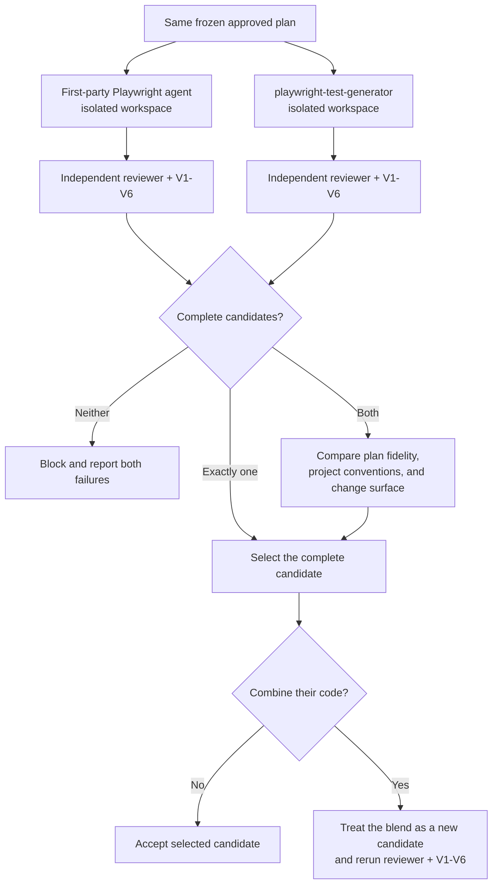

# Playwright Agents Interop (Playwright ≥ 1.56)

Playwright v1.56+ ships three first-party AI agents — **planner** (explores the app, writes a Markdown test plan to `specs/`), **generator** (turns plans into specs), **healer** (re-runs failures, re-resolves locators by semantic intent, patches). Docs: https://playwright.dev/docs/test-agents

## When to prefer which

| Situation | Use |
|-----------|-----|
| Playwright < 1.56, upgrade is risky (e.g. pixel-perfect visual baselines would need full re-capture) | This skill's pipeline as-is — do not upgrade just for agents |
| Playwright ≥ 1.56, interactive session, few targeted specs | This skill's pipeline (tighter approval gates, project-convention awareness) |
| Playwright ≥ 1.56, high-risk or ambiguous scenario where a second browser-grounded plan is worth the cost | First-party planner as an auxiliary plan hardener; this skill remains the final implementer and verifier |
| Supported `init-agents` host, bulk generation from an approved written plan | First-party loop; feed it the conventions doc + seed spec this skill produced in Step 5b |

## Setup

```bash
# Codex support verified with Playwright 1.62.1
npx --no-install playwright init-agents --loop=codex

# Other documented hosts
npx --no-install playwright init-agents --loop=claude   # also: --loop=vscode, --loop=opencode
```

The Codex command produces `playwright_test_planner`,
`playwright_test_generator`, and `playwright_test_healer` definitions under
`.codex/agents/`, plus the plan/seed scaffolding. Those definitions run the
project-local `npx playwright run-test-mcp-server`; they do not require users to
register generic `@playwright/mcp` globally. Regenerate them after updating
Playwright so their instructions and tool allowlists do not drift.

The seed test is executable context bootstrap. Point it at the selected
Playwright project and its existing fixtures, authentication, setup, and hooks
rather than letting an agent invent a parallel harness. A passing seed proves
only that setup works; it is not product-behavior evidence.

Pass the selected Playwright project explicitly when setting up the seed. Do
not rely on the configuration's first project: it may be a dependency-only
authentication or environment setup project rather than the browser project
that owns the approved scenario.

## Admission gate

Use this optional path only when all of the following are already true:

- `npx --no-install playwright help init-agents` confirms that the target
  project's installed Playwright exposes the first-party agent command;
- `init-agents` output for the current host already exists and still matches
  the project-local Playwright installation;
- the delegated agent itself exposes its required setup, browser, and
  plan-saving tools and can launch them in that execution boundary; and
- the extra model/browser cost is justified by an approved high-risk flow or
  an explicit comparison.

Do not infer delegated-agent readiness from a successful parent-session MCP
probe: some hosts can expose the project-local Playwright MCP server to the
parent without forwarding the agent-scoped tools to a child. On Codex, confirm
that the delegated planner can see both `planner_setup_page` and
`planner_save_plan` before paying for live exploration. Treat a missing tool as
an unavailable auxiliary path, not as evidence about the application.

Do not install a newer standalone Playwright, patch generated agent commands,
or upgrade the project solely to make this auxiliary path available. If an
agent browser has already failed to launch in the current host/session, skip
the auxiliary path instead of spending a full planner call on source-only
advice. Continue with this skill's normal live-browser pipeline.

## Division of labor with this skill

- The conventions doc + seed spec from Step 5b are exactly what the planner/generator consume best — generate them first, then hand off.
- The healer's intent-based locator re-resolution is the same approach as this skill's Step 7 failure handling; on < 1.56 projects, this skill's loop is the fallback.
- Never let the first-party generator and this skill edit the same candidate at
  the same time. For a comparison, give both the same frozen approved plan and
  isolated workspaces, then treat both outputs as untrusted candidates.
- Run every selected generated or healed candidate through `e2e-reviewer` and
  the applicable V1–V6 checks. A passing or skipped healer result is not an
  acceptance verdict.

## Recommended auxiliary mode: harden the plan

Use the first-party planner as a second set of browser-grounded eyes when the
approved scenario is high-risk, its failure conditions are incomplete, or its
locator mapping remains uncertain. This is cheaper and safer than always
running two full generators:

1. Freeze the user-approved scenario, target, permissions, conventions, and
   seed. Ask the planner to preserve that scope and return plan deltas only.
2. Separate every delta into `observed` browser evidence, source/seed-only
   `inference`, a proposed verification condition, or a stated limitation.
   A locator is observed only when the planner resolved it against the live
   page; source markup and an unexecuted seed do not qualify.
   Persist the compact observed role/name/state mapping in the planner delta
   before another test run can replace `test-results/` or the HTML report. Do
   not hand the implementer a path to a transient error context as the only
   copy of browser evidence.
3. Absorb useful acceptance criteria, failure conditions, read/write guards,
   and state-transition checks. Do not copy inferred locators into the final
   test as if they were observed.
4. If a delta changes scenario count, product behavior, expected values,
   target-controlled commands, or control files, return it to the Step 4
   approval gate. Clarifications that only make an already-approved outcome
   load-bearing may proceed without manufacturing a new scenario.
5. Let this skill implement the hardened plan in the repository's established
   POM/spec style, then run `e2e-reviewer` and V1–V6 normally.

If the planner could not perform live exploration, its output is still useful
as a checklist, but it cannot promote locator or application-state guesses to
evidence. Record that limitation and keep the existing observed Locator Mapping
Table authoritative. If no durable observed mapping exists, return to this
skill's normal Step 2 exploration and do not write a candidate yet; a planner
checklist alone does not authorize source-inferred locators.

The first-party generator becomes an optional second candidate only after the
planner produced live browser evidence for the states and locators it relies
on. Generate into an isolated workspace and use the selection procedure below.
The healer may diagnose and repair mechanics in that candidate, but it may not
weaken the approved outcome, expected value, request proof, scenario count, or
test enablement. Re-review and rerun applicable V-rules after every heal.

## Optional dual-candidate trial

Use two generators only when the extra model and browser work is justified by a
high-risk flow or an explicit evaluation. Give both arms the same frozen,
approved scenario plan, project snapshot, and tool permissions. Use separate
workspaces and separate disposable state, ports, caches, and browser profiles.
Run the arms sequentially unless those boundaries are proven independent.



Do not average gate results or let a stronger candidate hide the other
candidate's failure. If both are complete, prefer the candidate that matches
the approved behavior and existing project conventions with the smaller
necessary change surface. If that comparison is still tied, report the tie
instead of manufacturing an automatic winner. This is an opt-in selection
procedure, not evidence that either generator is generally more accurate.
